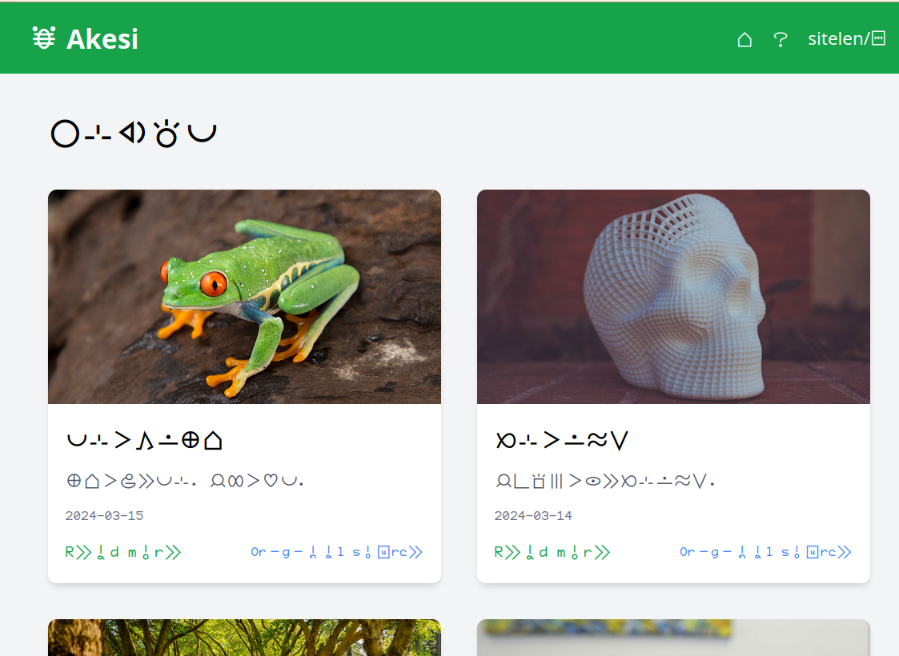

# Akesi

Toki! Akesi is a web site designed to help users learn and explore Toki Pona through news stories and interactive tools. Visit the live site at [akesi.site](https://akesi.site).

You are free to clone and use this code. Requests for a hosted version of Akesi are welcome. Individual documents can also be submitted and hidden or included in the main feed.

## Features

- News stories in Toki Pona
- Interactive tools to assist with reading and learning
- About page with information on Toki Pona and the purpose of Akesi
- Responsive design for various screen sizes

## Tools

- Depending on user settings, the EnhancedText component renders text with Toki Pona words highlighted with a tooltip that shows the word's meaning. Text can be in latin, or sitelen pona with or without UCSUR encoding.
- Pagination for browsing older and newer stories
- A backend API for submitting and fetching stories

## About Toki Pona

Toki Pona is a minimalist constructed language created by Sonja Lang in 2001. It features a vocabulary of around 120 root words and a simple grammar, encouraging clear thinking and essential communication. Learn more about Toki Pona at [tokipona.org](https://tokipona.org).

## Credits

- [Toki Pona language](https://tokipona.org) created by Sonja Lang. Pona!
- Akesi web application developed by [Colin Jacobs](https://coljac.info)

## Contributing

We welcome contributions to improve the functionality and user experience of Akesi. Any issues or pull requests are appreciated.

## TODO

The javascript and react code should be packaged up and made into a nice library for everyone to use.
